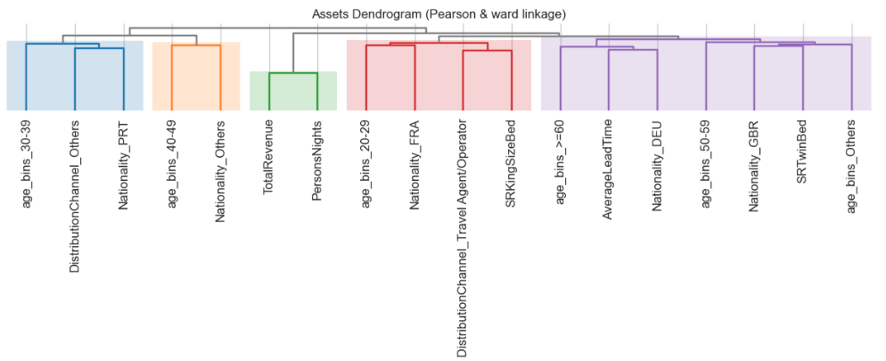

<div align="center">

# Hotel Customer Segmentation Project
A hotel's customers personal, behavioral, demographic, and geographic dataset from Lisbon, Portugal (2015-2018).

Antonio, N., de Almeida, A., & Nunes, L. (2020). A hotel's customers personal, behavioral, demographic, and geographic dataset from Lisbon, Portugal (2015–2018). Data in Brief, 33, 106583. https://doi.org/10.1016/j.dib.2020.106583. Retrieved from https://www.sciencedirect.com/science/article/pii/S2352340920314645

</div>

## CRISP-DM Methodology

CRISP-DM is like our roadmap for exploring and understanding data. It breaks down complex data projects into manageable steps, starting from understanding what the business needs are, all the way to deploying our solutions. It's super helpful because it keeps us organized and ensures we're on track with our goals. Plus, it's not just for one specific industry, so we can apply it to all sorts of projects, which is awesome for learning and building our skills. It's basically our guide to navigating the world of data mining!

<p align="center">
  
</p>

<p align="center">
  CRISP-DM process diagram
</p>

*    **Business Understanding**: determine business objectives; assess situation; determine data mining goals; produce project plan
*    **Data Understanding**: collect initial data; describe data; explore data; verify data quality
*    **Data Preparation** (generally, the most time-consuming phase): select data; clean data; construct data; integrate data; format data
*    **Modeling**: select modeling technique; generate test design; build model; assess model
*    **Evaluation**: evaluate results; review process; determine next steps
*    **Deployment**: plan deployment; plan monitoring and maintenance; produce final report; review project (deployment was not required for this project)

[Reference](https://github.com/mbenetti/CRISP-DM-Rossmann/blob/master/README.md)

### **Introduction**
<p>Finding new customers is vital in every industry. The process for finding new customers begins by learning as much as possible from the existing customers. Understanding current customers allow organizations to identify groups of customers that have different product interests, different market participation, or different response to marketing efforts. Market segmentation, the process of identifying customers’ groups, makes use of geographic, demographic, psychographic, and behavioral characteristics of customers. By understanding the differences between the different segments, organizations can make better strategic choices about opportunities, product definition, positioning, promotions, pricing, and target marketing. Like most hotels, hotel H , a hotel located in Lisbon, Portugal, member of the independent hotel chain C, uses a hospitality standard market segmentation based on the origin of the customer. However, A, the new marketing manager of hotel H, recognized that this type of segmentation, as is today well-known, is not useful for the hotel marketing department.</p>

### **Customer segmentation in hotel H**
<p>Until 2015 hotel chain C operated 4 hotels, however, with the acquisition of new hotels, the hotel chain board decided to invest more in marketing. However, it was not until 2018 that the hotel chain created a marketing department and hired a new marketing manager, A. A realized that the current customer segmentation was not adequate, as it only reflected one only customer characteristic, its sales origin. It did not reflect geographic characteristics, such as the country of origin, demographic characteristics such as age, or behavioral characteristics such as the number of stays.

Without a proper customer segmentation, is difficult for A to define a strategy to reach new customers and to continue to captivate the current customers. In particular, taking into consideration the multiple distribution channels that hotels operate nowadays (travel agencies, travel operators, online travel agencies - OTA, brand website, meta searchers websites, among others). For example, corporate customers tend to make reservations very near arrival date, book directly with the hotel, and be willing to pay more for a better equipped room, while a customer on holidays tend to make reservations more distant of the arrival date, book with a travel operator or OTA, and to look for better price opportunities. Therefore, products “creation”, pricing definitions, and other marketing tasks, such as advertising, must take into consideration the targets of its efforts, according to the different channels and groups of customers.</p>

### **The challenge**

Instead of applying on the traditional hospitality segmentation to divide customers into groups, the challenge proposed by A to the hotel chain marketing department team is to create a more up-to-date, data-driven, customer segmentation based on the hotel H’s customer database.

### **Questions or additional informations**

For any additional questions, don't hesitate to get in touch with one of the instructors. The instructors will also act as the hotel company/project stakeholder.

### Dataset Description   
<br>

| Variable             | Type       | Description                                                                                                                             |
|----------------------|------------|-----------------------------------------------------------------------------------------------------------------------------------------|
| ID                   | Numeric    | Customer ID                                                                                                                             |
| Nationality          | Categorical| Country of origin. Categories are represented in the ISO 3155–3:2013 format                                                             |
| Age                  | Numeric    | Customer's age (in years) at the last day of the extraction period                                                                     |
| DaysSinceCreation    | Numeric    | Number of days since the customer record was created (number of days elapsed between the creation date and the last day of extraction) |
| NameHash             | Categorical| SHA2–256 hash-string of the customer's name.                                                                                            |
| DocIDHash            | Categorical| SHA2–256 hash-string of the identification document number the customer provided at check-in (passport number, national ID card number, or other)|
| AverageLeadTime      | Numeric    | The average number of days elapsed between the customer's booking date and arrival date.                                                 |
| LodgingRevenue       | Numeric    | Total amount spent on lodging expenses by the customer (in Euros). Includes room, crib, and other related lodging expenses              |
| OtherRevenue         | Numeric    | Total amount spent on other expenses by the customer (in Euros). Includes food, beverage, spa, and other expenses                        |
| BookingsCanceled     | Numeric    | Number of bookings made by the customer but subsequently canceled (the customer informed the hotel they would not come to stay)         |
| BookingsNoShowed     | Numeric    | Number of bookings made by the customer but subsequently marked as a “no-show” (the customer did not cancel but did not check-in)       |
| BookingsCheckedIn    | Numeric    | Number of bookings made by the customer that resulted in a stay                                                                         |
| PersonsNights        | Numeric    | The total number of persons/nights that the customer stayed at the hotel. Calculated by summing all customers' checked-in bookings’ persons/nights.   |
| RoomNights           | Numeric    | Total room/nights the customer stayed at the hotel (checked-in bookings). Calculated as the multiplication of the number of rooms of each booking by the number of nights of the booking |
| DaysSinceLastStay    | Numeric    | The number of days elapsed between the last day of the extraction and the customer's last arrival date (of a checked-in booking). A value of −1 indicates the customer never stayed at the hotel |
| DaysSinceFirstStay   | Numeric    | The number of days elapsed between the last day of the extraction and the customer's first arrival date (of a checked-in booking). A value of −1 indicates the customer never stayed at the hotel |
| DistributionChannel  | Categorical| Distribution channel usually used by the customer to make bookings at the hotel                                                         |
| MarketSegment        | Categorical| Current market segment of the customer                                                                                                  |
| SRHighFloor          | Boolean    | Indication if the customer usually asks for a room on a higher floor (0: No, 1: Yes)                                                   |
| SRLowFloor           | Boolean    | Indication if the customer usually asks for a room on a lower floor (0: No, 1: Yes)                                                    |
| SRAccessibleRoom     | Boolean    | Indication if the customer usually asks for an accessible room (0: No, 1: Yes)                                                          |
| SRMediumFloor        | Boolean    | Indication if the customer usually asks for a room on a middle floor (0: No, 1: Yes)                                                   |
| SRBathtub            | Boolean    | Indication if the customer usually asks for a room with a bathtub (0: No, 1: Yes)                                                       |
| SRShower             | Boolean    | Indication if the customer usually asks for a room with a shower (0: No, 1: Yes)                                                        |
| SRCrib               | Boolean    | Indication if the customer usually asks for a crib (0: No, 1: Yes)                                                                      |
| SRKingSizeBed        | Boolean    | Indication if the customer usually asks for a room with a king-size bed (0: No, 1: Yes)                                                |
| SRTwinBed            | Boolean    | Indication if the customer usually asks for a room with a twin bed (0: No, 1: Yes)                                                      |
| SRNearElevator       | Boolean    | Indication if the customer usually asks for a room near the elevator (0: No, 1: Yes)                                                   |
| SRAwayFromElevator   | Boolean    | Indication if the customer usually asks for a room away from the elevator (0: No, 1: Yes)                                               |
| SRNoAlcoholInMiniBar| Boolean    | Indication if the customer usually asks for a room with no alcohol in the mini-bar (0: No, 1: Yes)                                     |
| SRQuietRoom          | Boolean    | Indication if the customer usually asks for a room away from the noise (0: No, 1: Yes)                                                  |

For further details [original article](https://www.sciencedirect.com/science/article/pii/S2352340920314645)

- Antonio, N., de Almeida, A., & Nunes, L. (2020). A hotel's customers personal, behavioral, demographic, and geographic dataset from Lisbon, Portugal (2015–2018). Data in Brief, 33, 106583. https://doi.org/10.1016/j.dib.2020.106583. Retrieved from https://www.sciencedirect.com/science/article/pii/S2352340920314645

### Imports
This project has following libraries:
```python

# Data Manipulation and Analysis
import pandas as pd
import numpy as np

# Data Visualization
import matplotlib.pyplot as plt
import seaborn as sns
import altair as alt
from yellowbrick.cluster import InterclusterDistance
from yellowbrick.cluster import SilhouetteVisualizer

# Data Preprocessing
from sklearn import preprocessing

# Clustering
from sklearn.cluster import KMeans
from sklearn.metrics import silhouette_score
from yellowbrick.cluster import KElbowVisualizer

# Dendogram
import riskfolio as rp

# Dimensionality Reduction
from sklearn.decomposition import PCA

# Additional Utilities
import matplotlib.ticker as ticker

%matplotlib inline

# Ignore FutureWarnings
import warnings
warnings.simplefilter(action='ignore', category=FutureWarning)

# Set seaborn style
sns.set_style("whitegrid")

# Set the max_columns option to None to display all columns
pd.set_option('display.max_columns', None)
```
### Results
<br>

| Attribute                                  | Cluster 0    | Cluster 1    | Cluster 2    |
|--------------------------------------------|--------------|--------------|--------------|
| Average Lead Time                          | 71.228237    | 78.252560    | 82.615470    |
| Distribution Channel - Others              | 0.031449     | 0.051542     | 0.037599     |
| Distribution Channel - Travel Agent/Operator| 0.871996     | 0.803395     | 0.835719     |
| Nationality - DEU                          | 0.094041     | 0.157058     | 0.102660     |
| Nationality - FRA                          | 0.036783     | 0.290467     | 0.103705     |
| Nationality - GBR                          | 0.112249     | 0.120509     | 0.073908     |
| Nationality - Others                       | 0.617030     | 0.227496     | 0.623764     |
| Nationality - PRT                          | 0.139897     | 0.204470     | 0.095964     |
| Persons Nights                             | 5.349068     | 5.359943     | 5.655219     |
| SR King Size Bed                           | 0.658718     | 0.155361     | 0.241629     |
| SR Twin Bed                                | 0.068906     | 0.155813     | 0.164281     |
| Total Revenue                              | 370.426359   | 363.866088   | 386.369934   |
| Age Bins - 20-29                           | 0.120893     | 0.154512     | 0.106285     |
| Age Bins - 30-39                           | 0.572707     | 0.053805     | 0.000000     |
| Age Bins - 40-49                           | 0.123713     | 0.557624     | 0.000000     |
| Age Bins - 50-59                           | 0.000000     | 0.000000     | 0.704675     |
| Age Bins - >=60                            | 0.165216     | 0.204413     | 0.163482     |
| Age Bins - Others                          | 0.017472     | 0.029646     | 0.025558     |
<br>

Cluster 0: **Young King-Sizers**

- *Average Lead Time*: 71.23 days (shortest).
- *Distribution Channel*: Highest preference for "Travel Agent/Operator".
- *Nationality*: Higher representation of Portuguese (PRT) nationals.
- *Room Type*: Prefer King Size Beds.
- *Age*: Predominantly aged 30-39.

Cluster 1: **Middle-Aged Twin-Bedders**

- *Average Lead Time*: 78.25 days.
- *Distribution Channel*: Strong preference for "Travel Agent/Operator".
- *Nationality*: Higher prevalence of German (DEU) and French (FRA) nationals.
- *Room Type*: Prefer Twin Beds.
- *Age*: Predominantly aged 40-49.

Cluster 2: **Senior Balanced Preferences**

- *Average Lead Time*: 82.62 days (longest).
- *Nationality*: Highest percentage of "Others".
- *Room Type*: Balanced preference between King Size and Twin Beds.
- *Age*: Predominantly aged 50-59, followed by those aged 60 and above.

### Dendogram
<br>

<p align="center">
  
</p>
